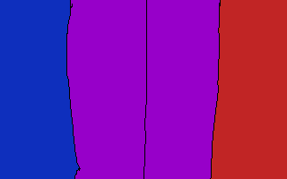

# Notes

## Buzzwords
- colour-based mutation
- alpha-beta boid mechnanics
- four quadrants
- two players
- "survival of the biggest"

## Map Concept

## Explanation
- each player starts at an end of the map (player1: blue, player2: red)
  - the other player cannot go into they opposite starting area
- they control an "alpha entity"
  - that entity is constantly spawning "beta entities"
    - beta entities collect resources, each time they do, it spawns more beta entities
    - beta entities loosely move toward the alpha entity but they are generally autonomous
    - beta entities kill opposing beta entities and do small amounts of damage to predators and opposing alpha entities
- beside the starting area there is a no-man's land (purple)
  - it has a lot of resources but it also has predators
    - predators are scary when you're small but not when you're large
  - resources respawn in no-man's land
- the goal of the game is to destroy the other opposing alpha entity
  - you must balance early game safe economy with venturing into no-man's land
  - if you get double the beta entities of your opponent, you can force your way into their end of the map

## Additional Ideas
- beta entities change colour a little each time they spawn children
  - resources are colour-coded
  - more different beta entities with different colours means more food opportunities

## Art
- entities
  - alpha
    - big & important
    - only one of them
  - beta
    - a bunch of them
- predators
  - somewhat large than alphas
  - scary
- background
  - 1280x720px
  - four(ish) sections (see Map Concept)
- resources
  - small
  - smaller than betas
- style
  - we've been talking about applying a futuristic feel to it
  - hive mind
  - cyborg ants
  - the borg
  - greyscale?
    - allows me to tint alphas and betas according to orientation/mutation
